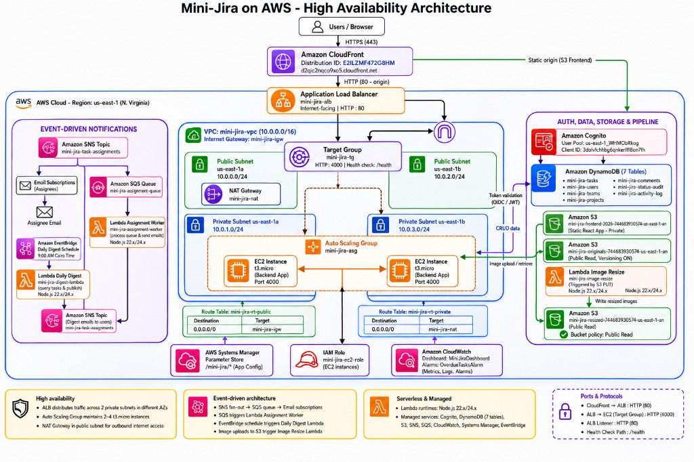

# Mini-Jira on AWS — Project Deliverables

## 1. Live application (CloudFront)

**Public URL (no extra configuration):**  
**<https://d2qic2nqco9xo5.cloudfront.net>**

| Item | Value |
|------|--------|
| CloudFront distribution ID | `E2ILZMF472G8HM` |
| Region | `us-east-1` (N. Virginia) |
| API health check | <https://d2qic2nqco9xo5.cloudfront.net/health> |

Opening the CloudFront URL serves the React frontend from S3. Requests to `/api/*` are forwarded to the Application Load Balancer and the Node.js backend on EC2.

---

## 2. Architecture diagram (high availability)

The diagram below was drawn with **[AWS Architecture Icons](https://aws.amazon.com/architecture/icons/)** (standard AWS service icons). Source file in this repo: [`architecture.png`](architecture.png).

## 3. Demo video

| Status | Link |
|--------|------|
| **Available** | [Demo Video — Google Drive](https://drive.google.com/drive/folders/1qBYGo3r_aTpKkPnwIaeUyPL56Cr3MvEK?usp=sharing) |

**Direct link:** <https://drive.google.com/drive/folders/1qBYGo3r_aTpKkPnwIaeUyPL56Cr3MvEK?usp=sharing>

The recording covers the CloudFront app, manager/employee demo scenario (Ali / Sara / Omar), Kanban and task details, image upload, assignment notifications, and CloudWatch/architecture overview.

---

## 4. Related documentation

| Document | Description |
|----------|-------------|
| [`README.md`](../README.md) | Setup, API summary, DynamoDB schemas |
| [`DEPLOY.md`](../DEPLOY.md) | Operator runbook (CloudFormation, deploy scripts) |
| [`S3_IMAGE_PIPELINE.md`](S3_IMAGE_PIPELINE.md) | Image upload, resize Lambda, CORS |

**GitHub repository:** <https://github.com/Judy747/mini-jira-aws>

---

## 5. Submission checklist

- [x] Demo video URL added in **Section 3** — [Google Drive](https://drive.google.com/drive/folders/1qBYGo3r_aTpKkPnwIaeUyPL56Cr3MvEK?usp=sharing)
- [ ] Google form submitted with repo link, CloudFront URL, and video link
- [ ] **Stop** (do not terminate) EC2/ASG and other resources after submission
